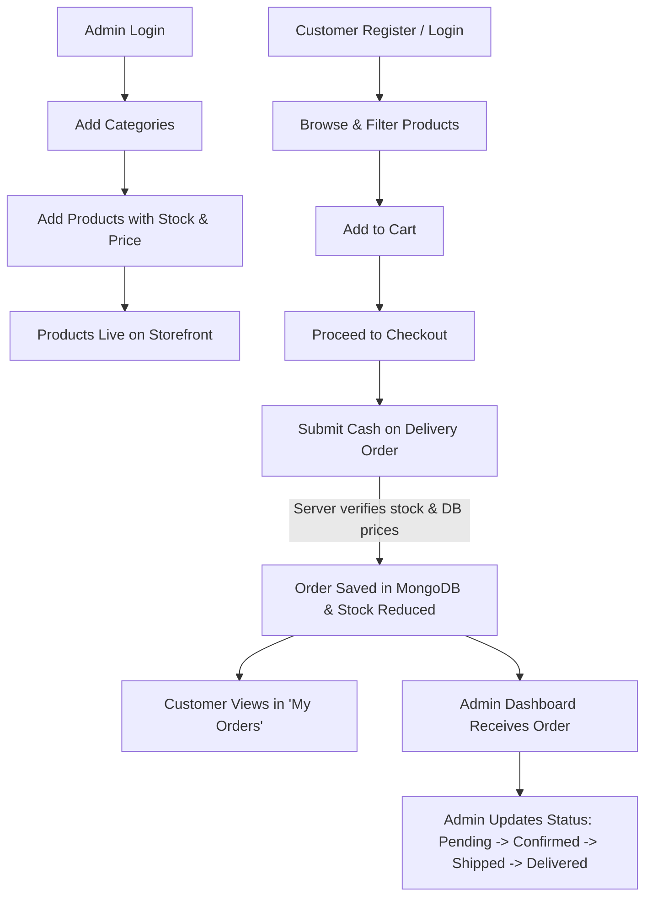

# Mini E-Commerce MERN Demo

> A lightweight, clean, and fully-featured **MERN Stack** (MongoDB, Express.js, React + Vite, Node.js) Mini E-Commerce Demo application designed for educational demonstrations, rapid prototyping, and portfolio presentation.

---

## 📌 Project Overview

This project is a streamlined, full-stack e-commerce demo that showcases core e-commerce capabilities without overwhelming bloat or external third-party dependencies (e.g. no payment gateways or multi-vendor logic). It provides a robust, decoupled architecture separating the **React (Vite) client** and the **Express/Node.js server**, persisted by **MongoDB via Mongoose**.

### Key Highlights
- **Role-Based Access Control (RBAC):** Customer registration/authentication alongside Admin capabilities with JWT & bcrypt.
- **Dynamic Catalog & Filtering:** Search by keyword, filter by categories, and browse responsive product grids.
- **Cart & Stock Integrity:** Quantity adjustments bounded by real-time inventory limits.
- **Server-Authoritative Checkout:** Price validation and stock deduction performed server-side for Cash on Delivery (COD) orders.
- **Dedicated Admin Dashboard:** Category management, inventory/product catalog CRUD, and order lifecycle tracking.
- **Clean Tailwind CSS UI:** Responsive design across mobile, tablet, and desktop with loading states, modals, and toast alerts.

---

## 🛠️ Tech Stack

| Layer | Technology | Description |
|---|---|---|
| **Frontend** | React 18+ (Vite) | Fast single-page application bundling and rendering |
| **Language** | JavaScript (ES6+) | Modern standard JS across client and server |
| **Styling** | Tailwind CSS | Utility-first, responsive, and modern design system |
| **HTTP Client** | Axios | Promise-based HTTP client with interceptors for JWT |
| **Backend** | Node.js + Express.js | RESTful API server and route middlewares |
| **Database** | MongoDB + Mongoose | Document-oriented database and ODM schemas |
| **Auth & Security** | JSON Web Tokens (JWT) + bcryptjs | Stateless auth tokens and salted password hashing |

---

## 📁 Repository Structure

```text
/
├── README.md                      # Main project documentation
├── docs/                          # Detailed architecture & engineering docs
│   ├── ARCHITECTURE_AND_SECURITY.md # Architecture, auth lifecycle & security rules
│   ├── DATABASE_DESIGN.md         # MongoDB/Mongoose schemas and models
│   ├── API_SPECIFICATION.md       # Complete REST API documentation & payloads
│   ├── FRONTEND_SPECIFICATION.md  # UI/UX design, Tailwind layout & pages
│   └── IMPLEMENTATION_ROADMAP.md  # Phased execution checklist for development
├── client/                        # React + Vite Frontend (To be initialized)
└── server/                        # Node.js + Express Backend (To be initialized)
```

---

## 🔄 Main Demo Flow



---

## 📑 Core Features

### 1. Customer Experience (Public Website)
- **Home & Catalog:** Modern landing page with hero banner, category pills, and featured items.
- **Search & Filters:** Real-time search by product name and category filter (`All | Electronics | Fashion | Shoes`).
- **Product Details:** High-resolution view, description, real-time stock indicator, and add-to-cart controls.
- **Interactive Cart:** Slide-over or dedicated cart page with quantity increment/decrement guarded by available stock.
- **Cash on Delivery Checkout:** Simplified checkout form capturing Name, Phone, Address, City, and Pincode.
- **Order Tracking:** "My Orders" view showing customer order history, status tags, and item summaries.

### 2. Admin Operations (Dashboard)
- **Category Management:** Create, view, update, and delete categories with usage checks.
- **Product Management:** Create products with name, price, stock, category reference, and image URL. Update and delete with confirmation dialogs.
- **Order Management:** View all customer orders across the platform, inspect customer shipping details, and transition statuses (`Pending`, `Confirmed`, `Shipped`, `Delivered`, `Cancelled`).

### 3. Security & Validation
- **Server-Side Price Authority:** Cart prices from the client are discarded; order totals are computed strictly from database records.
- **Inventory Safety:** Orders validate stock availability in database before confirming, preventing overselling.
- **Password Protection:** Minimum 6-character validation, confirmation matching, and 10-salt-round bcrypt hashing.
- **Protected Routing:** Token verification middleware for authenticated customers and role-check middleware for admins.

---

## 📚 Detailed Documentation

Explore the comprehensive specifications in the [`/docs`](docs/) directory:

- 📖 **[Architecture & Security](docs/ARCHITECTURE_AND_SECURITY.md)**: System design, JWT token handling, middlewares, and data validation.
- 🗄️ **[Database Design](docs/DATABASE_DESIGN.md)**: Mongoose schemas for `User`, `Category`, `Product`, and `Order`.
- 🔌 **[API Specification](docs/API_SPECIFICATION.md)**: REST endpoints, request parameters, status codes, and JSON response contracts.
- 🎨 **[Frontend Specification](docs/FRONTEND_SPECIFICATION.md)**: Page layouts, UI component hierarchy, and Tailwind configuration.
- 🚀 **[Implementation Roadmap](docs/IMPLEMENTATION_ROADMAP.md)**: Phased development plan for building the server and client.

---

## ⚙️ Environment Variables (Preview)

### Backend (`/server/.env`)
```env
PORT=5000
MONGODB_URI=mongodb://localhost:27017/mini-ecom
JWT_SECRET=your_super_secret_jwt_key_here
JWT_EXPIRES_IN=7d
NODE_ENV=development
```

### Frontend (`/client/.env`)
```env
VITE_API_BASE_URL=http://localhost:5000/api
```

---

## 🚀 Getting Started (When Ready to Build)

1. **Clone the repository:**
   ```bash
   git clone https://github.com/aryanpanchal20/e-com.git
   cd e-com
   ```

2. **Server Setup:**
   ```bash
   cd server
   npm install
   npm run dev
   ```

3. **Client Setup:**
   ```bash
   cd client
   npm install
   npm run dev
   ```

---

## 📄 License
This project is licensed under the MIT License - feel free to use it for learning, prototyping, and demonstrations.
