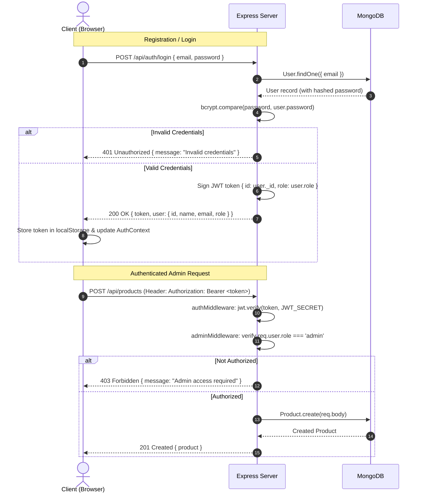
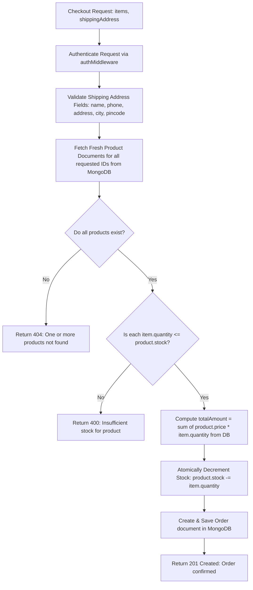

# Architecture & Security Specification

This document details the system architecture, authentication/authorization lifecycle, and defensive engineering practices implemented across the Mini E-Commerce project.

---

## 1. High-Level System Architecture

The application adopts a classic decoupled **Client-Server Architecture** communicating over a stateless JSON-based RESTful API.

```mermaid
graph LR
    subgraph Client [Client - React + Vite]
        UI[Tailwind CSS UI]
        Router[React Router]
        AxiosClient[Axios Instance + Interceptors]
        Context[Auth & Cart State]
    end

    subgraph Server [Server - Node.js + Express]
        Middleware[Auth & Admin Middleware]
        Controllers[API Controllers]
        Validation[Input & Security Validation]
        MongooseODM[Mongoose ODM]
    end

    subgraph Database [Database - MongoDB]
        MongoCollections[(Users / Categories / Products / Orders)]
    end

    UI --> Router
    Router --> Context
    Context --> AxiosClient
    AxiosClient -->|HTTP / JSON Requests with Bearer Token| Middleware
    Middleware --> Controllers
    Controllers --> Validation
    Validation --> MongooseODM
    MongooseODM --> MongoCollections
```



### Architectural Principles
1. **Stateless Backend:** No server-side session cookies or session state. All authenticated interactions use cryptographically signed JSON Web Tokens (JWT).
2. **Separation of Concerns:** 
   - The `/client` solely handles presentation, local state, and user interactions.
   - The `/server` orchestrates business logic, database transactions, validation, and authorization.
3. **Zero Trust for Client-Supplied Financials:** Any financial figure, item price, or calculated total sent from the frontend is discarded. The backend always queries current values directly from the database before writing orders.

---

## 2. Authentication & Authorization Lifecycle

### User Roles
The system distinguishes between two primary roles:
- `customer`: Can browse products, manage personal cart, place orders, and view own order history.
- `admin`: Has all customer capabilities plus access to admin dashboard routes (Categories CRUD, Products CRUD, View all platform orders, and update order statuses).

### Authentication Flow (Customer & Admin)



### Middleware Design

#### 1. `authMiddleware` (`protect`)
- Extracts the token from `req.headers.authorization` looking for `Bearer <token>`.
- Decodes and verifies the signature using `JWT_SECRET`.
- Attaches the verified user payload (or loads the user minus password from DB) to `req.user`.
- Rejects with `401 Unauthorized` if token is missing, expired, or invalid.

#### 2. `adminMiddleware` (`requireAdmin`)
- Must run **after** `authMiddleware`.
- Checks `req.user.role === 'admin'`.
- Rejects with `403 Forbidden` if user is not an administrator.

---

## 3. Order Processing & Transaction Security

When a customer initiates checkout with Cash on Delivery (COD), the backend must enforce strict data integrity rules.



### Critical Security Rule: Never Trust Client Pricing
```javascript
// Server-side calculation pattern
let totalAmount = 0;
const verifiedOrderItems = [];

for (const cartItem of req.body.products) {
  const dbProduct = await Product.findById(cartItem.product);
  if (!dbProduct) {
    return res.status(404).json({ message: `Product ${cartItem.product} not found` });
  }
  if (dbProduct.stock < cartItem.quantity) {
    return res.status(400).json({ message: `Insufficient stock for ${dbProduct.name}` });
  }

  // Use authoritative DB price
  const itemPrice = dbProduct.price; 
  totalAmount += itemPrice * cartItem.quantity;

  verifiedOrderItems.push({
    product: dbProduct._id,
    name: dbProduct.name,
    price: itemPrice, // Saved snapshot at time of purchase
    quantity: cartItem.quantity,
    image: dbProduct.image
  });
}
```

---

## 4. Input Validation & Error Handling Matrix

| Scope | Validation Rule | Backend Handling | Frontend Handling |
|---|---|---|---|
| **Registration** | Email format, Password >= 6 chars, Password === ConfirmPassword | Express validator / Mongoose regex validation. Reject if email exists (400 Conflict). | Real-time input checking & form submit validation with error messages. |
| **Category** | Unique name, trimmed, required | Mongoose `unique: true`, trim whitespace. | Required field validation on modal submit. |
| **Product** | Price > 0, Stock >= 0, Valid category ObjectId | Mongoose validation (`min: 0`), Category lookup verification. | Positive number input type with HTML5 and JS constraints. |
| **Cart** | Quantity <= available stock | Prevent order submission if quantity > stock. | Increment button disabled when `quantity === stock`. |
| **Checkout** | Phone is numeric, Address/City/Pincode not empty | Server-side validation before order creation. | Form fields marked `required` with regex pattern checking. |

---

## 5. Security Best Practices Checklist

- [x] **Password Protection:** Passwords stored using `bcryptjs` with salt round `10`. Never return password fields in query results (`select: false`).
- [x] **CORS Configuration:** Explicitly whitelist permitted origins (e.g. `http://localhost:5173` for Vite development).
- [x] **JWT Token Safety:** Tokens set with bounded expiration (e.g., `7d`). Stored in browser storage and passed exclusively via Authorization header.
- [x] **Idempotency & Race Protection:** Stock updates use atomic operations (`$inc: { stock: -quantity }` with `{ stock: { $gte: quantity } }`).
- [x] **Centralized Error Handling:** Consistent JSON error response shape `{ message: string, errors?: Array }` avoiding stack trace leaks in production.
