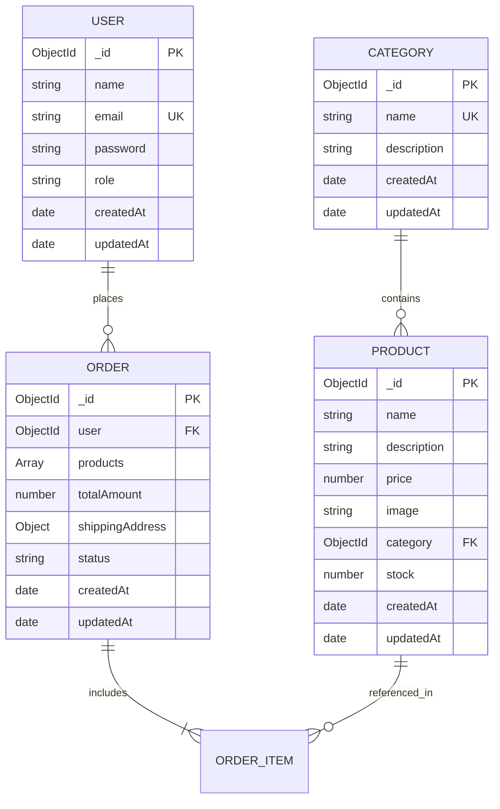

# Database Design Specification

This document details the MongoDB schemas and Mongoose models for the Mini E-Commerce project. In accordance with project requirements, exactly four models are defined: **User**, **Category**, **Product**, and **Order**.

---

## 1. Entity Relationship Diagram (ERD)



---

## 2. Model Schemas & Specifications

### 2.1 User Model (`User.js`)

Represents both regular customers and store administrators.

```javascript
const mongoose = require('mongoose');

const userSchema = new mongoose.Schema(
  {
    name: {
      type: String,
      required: [true, 'Please provide your full name'],
      trim: true,
      minlength: [2, 'Name must be at least 2 characters long'],
      maxlength: [50, 'Name cannot exceed 50 characters'],
    },
    email: {
      type: String,
      required: [true, 'Please provide an email address'],
      unique: true,
      trim: true,
      lowercase: true,
      match: [
        /^\w+([.-]?\w+)*@\w+([.-]?\w+)*(\.\w{2,3})+$/,
        'Please provide a valid email address',
      ],
    },
    password: {
      type: String,
      required: [true, 'Please provide a password'],
      minlength: [6, 'Password must be at least 6 characters long'],
      select: false, // Omit from default queries
    },
    role: {
      type: String,
      enum: ['customer', 'admin'],
      default: 'customer',
    },
  },
  {
    timestamps: true,
  }
);
```

#### Fields Description
| Field | Type | Required | Constraints / Defaults | Description |
|---|---|---|---|---|
| `_id` | ObjectId | Auto | Primary Key | Unique document identifier |
| `name` | String | Yes | Trimmed, 2-50 chars | Full name of the user |
| `email` | String | Yes | Unique, Lowercase, Regex valid | Primary authentication identifier |
| `password` | String | Yes | Min 6 chars, `select: false` | Salted bcrypt hash |
| `role` | String | Yes | Enum: `['customer', 'admin']`, default: `'customer'` | Access control role |
| `createdAt` | Date | Auto | Timestamps enabled | Account creation timestamp |
| `updatedAt` | Date | Auto | Timestamps enabled | Last update timestamp |

---

### 2.2 Category Model (`Category.js`)

Categorizes products to enable storefront filtering and admin organization.

```javascript
const mongoose = require('mongoose');

const categorySchema = new mongoose.Schema(
  {
    name: {
      type: String,
      required: [true, 'Category name is required'],
      unique: true,
      trim: true,
      maxlength: [50, 'Category name cannot exceed 50 characters'],
    },
    description: {
      type: String,
      trim: true,
      maxlength: [250, 'Description cannot exceed 250 characters'],
      default: '',
    },
  },
  {
    timestamps: true,
  }
);
```

#### Fields Description
| Field | Type | Required | Constraints / Defaults | Description |
|---|---|---|---|---|
| `_id` | ObjectId | Auto | Primary Key | Unique category identifier |
| `name` | String | Yes | Unique, trimmed, max 50 chars | Display name (e.g., "Electronics", "Fashion") |
| `description` | String | No | Trimmed, max 250 chars, default: `""` | Optional descriptive context |
| `createdAt` | Date | Auto | Timestamps enabled | Creation timestamp |
| `updatedAt` | Date | Auto | Timestamps enabled | Last modified timestamp |

---

### 2.3 Product Model (`Product.js`)

Represents catalog merchandise available for purchase.

```javascript
const mongoose = require('mongoose');

const productSchema = new mongoose.Schema(
  {
    name: {
      type: String,
      required: [true, 'Product name is required'],
      trim: true,
      maxlength: [100, 'Product name cannot exceed 100 characters'],
    },
    description: {
      type: String,
      required: [true, 'Product description is required'],
      trim: true,
      maxlength: [1000, 'Description cannot exceed 1000 characters'],
    },
    price: {
      type: Number,
      required: [true, 'Product price is required'],
      min: [0.01, 'Price must be greater than zero'],
    },
    image: {
      type: String,
      required: [true, 'Product image URL is required'],
      trim: true,
    },
    category: {
      type: mongoose.Schema.Types.ObjectId,
      ref: 'Category',
      required: [true, 'Product category is required'],
    },
    stock: {
      type: Number,
      required: [true, 'Product stock is required'],
      min: [0, 'Stock cannot be negative'],
      default: 0,
    },
  },
  {
    timestamps: true,
  }
);

// Compound index for category filtering and text search
productSchema.index({ name: 'text', description: 'text' });
productSchema.index({ category: 1 });
```

#### Fields Description
| Field | Type | Required | Constraints / Defaults | Description |
|---|---|---|---|---|
| `_id` | ObjectId | Auto | Primary Key | Unique product identifier |
| `name` | String | Yes | Trimmed, max 100 chars | Public display title |
| `description` | String | Yes | Trimmed, max 1000 chars | Item description and specifications |
| `price` | Number | Yes | Min: `0.01` (strictly positive) | Unit price in system currency |
| `image` | String | Yes | Trimmed string | Image URL (e.g. Unsplash or hosted image asset) |
| `category` | ObjectId | Yes | Reference to `Category` | Categorical classification |
| `stock` | Number | Yes | Min: `0`, Default: `0` | Available inventory count |
| `createdAt` | Date | Auto | Timestamps enabled | Creation timestamp |
| `updatedAt` | Date | Auto | Timestamps enabled | Last modified timestamp |

---

### 2.4 Order Model (`Order.js`)

Tracks purchases placed by customers with Cash on Delivery (COD).

```javascript
const mongoose = require('mongoose');

const orderItemSchema = new mongoose.Schema({
  product: {
    type: mongoose.Schema.Types.ObjectId,
    ref: 'Product',
    required: true,
  },
  name: {
    type: String,
    required: true,
  },
  price: {
    type: Number,
    required: true,
  },
  quantity: {
    type: Number,
    required: true,
    min: [1, 'Quantity must be at least 1'],
  },
  image: {
    type: String,
    required: true,
  },
});

const shippingAddressSchema = new mongoose.Schema({
  name: { type: String, required: [true, 'Recipient name is required'], trim: true },
  phone: { type: String, required: [true, 'Phone number is required'], trim: true },
  address: { type: String, required: [true, 'Street address is required'], trim: true },
  city: { type: String, required: [true, 'City is required'], trim: true },
  pincode: { type: String, required: [true, 'Pincode is required'], trim: true },
});

const orderSchema = new mongoose.Schema(
  {
    user: {
      type: mongoose.Schema.Types.ObjectId,
      ref: 'User',
      required: true,
    },
    products: [orderItemSchema],
    totalAmount: {
      type: Number,
      required: true,
      min: [0, 'Total amount must be a positive number'],
    },
    shippingAddress: {
      type: shippingAddressSchema,
      required: true,
    },
    status: {
      type: String,
      enum: ['Pending', 'Confirmed', 'Shipped', 'Delivered', 'Cancelled'],
      default: 'Pending',
    },
  },
  {
    timestamps: true,
  }
);

// Indexes for order lookups
orderSchema.index({ user: 1, createdAt: -1 });
orderSchema.index({ status: 1 });
```

#### Fields Description
| Field | Type | Required | Constraints / Defaults | Description |
|---|---|---|---|---|
| `_id` | ObjectId | Auto | Primary Key | Unique order identifier |
| `user` | ObjectId | Yes | Reference to `User` | User who placed the order |
| `products` | Array | Yes | Non-empty subdocuments | Snapshot of items ordered with unit price & qty |
| `totalAmount` | Number | Yes | Calculated server-side | Total order charge (Cash on Delivery) |
| `shippingAddress` | Subdoc | Yes | Includes name, phone, address, city, pincode | Physical delivery destination |
| `status` | String | Yes | Enum: `['Pending', 'Confirmed', 'Shipped', 'Delivered', 'Cancelled']`, default: `'Pending'` | Lifecycle state of order |
| `createdAt` | Date | Auto | Timestamps enabled | Time order was placed |
| `updatedAt` | Date | Auto | Timestamps enabled | Last status update timestamp |

---

## 3. Data Integrity & Stock Management Logic

### Snapshot Pattern for Products in Orders
When an order is created, product details (`name`, `price`, `image`) are snapshotted into the `orderItemSchema`. 
- **Reason:** If an admin alters product prices, titles, or deletes an item in the future, past order records and invoices remain completely preserved and accurate.

### Atomic Stock Reduction
When placing an order, stock must be reduced safely to prevent concurrency issues:
```javascript
// Atomic stock decrement query example
const product = await Product.findOneAndUpdate(
  { _id: item.productId, stock: { $gte: item.quantity } },
  { $inc: { stock: -item.quantity } },
  { new: true }
);

if (!product) {
  throw new Error(`Insufficient stock for item: ${item.productId}`);
}
```

### Stock Restocking on Order Cancellation
If an admin sets an order status to `'Cancelled'`, stock can be returned:
```javascript
if (newStatus === 'Cancelled' && currentOrder.status !== 'Cancelled') {
  for (const item of currentOrder.products) {
    await Product.findByIdAndUpdate(item.product, {
      $inc: { stock: item.quantity },
    });
  }
}
```
