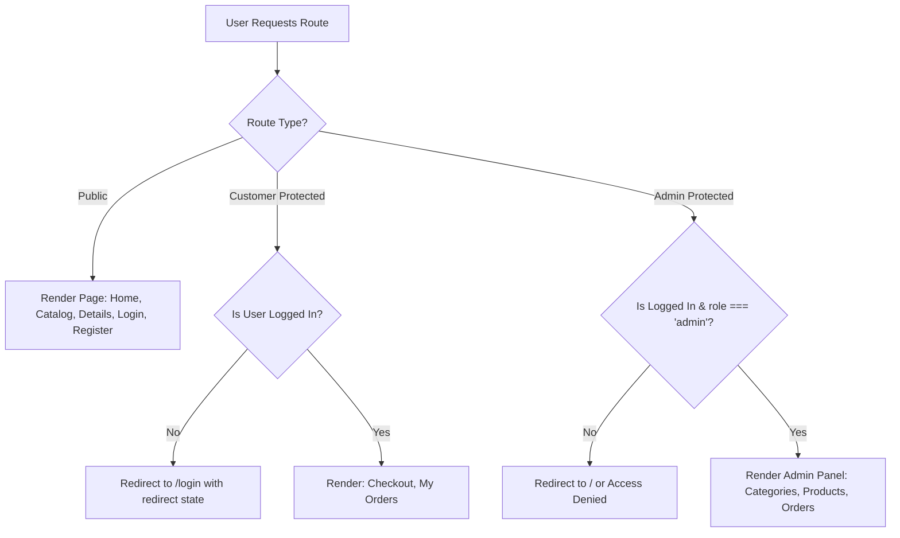

# Frontend Architecture & UI/UX Specification

This document details the frontend architecture, design guidelines, state management strategy, and page component layouts for the React + Vite single-page application.

---

## 1. UI/UX Principles & Design Tokens

### Design Principles
- **Modern & Professional:** Clean spacing, subtle shadows, crisp typography, and uncluttered layouts.
- **Mobile-First Responsive Layout:** Fluid grid breakpoints (`sm: 640px`, `md: 768px`, `lg: 1024px`, `xl: 1280px`).
- **Clear Visual Feedback:** Instant toast notifications, interactive button hover/active states, accessible empty-states, and skeleton or spinner loading states.
- **Defensive Controls:** Quantity increments disabled at stock maximum; delete actions gated behind confirmation modals.

### Tailwind Color Palette & Theme Tokens
```javascript
// tailwind.config.js theme extension
module.exports = {
  content: ["./index.html", "./src/**/*.{js,ts,jsx,tsx}"],
  theme: {
    extend: {
      colors: {
        brand: {
          50: '#f0fdf4',
          100: '#dcfce7',
          500: '#22c55e',
          600: '#16a34a',
          700: '#15803d',
        },
        surface: {
          light: '#f8fafc',
          card: '#ffffff',
          dark: '#0f172a',
        },
        status: {
          pending: '#f59e0b',
          confirmed: '#3b82f6',
          shipped: '#8b5cf6',
          delivered: '#10b981',
          cancelled: '#ef4444',
        }
      }
    }
  }
}
```

---

## 2. Component Hierarchy & Directory Architecture

```text
client/src/
├── assets/                  # Static media, icons, and illustrations
├── components/
│   ├── common/              # Shared UI components
│   │   ├── Navbar.jsx       # Responsive header with cart badge & auth menu
│   │   ├── Footer.jsx       # Standard footer with info & links
│   │   ├── LoadingSpinner.jsx # Accessible animated loading indicator
│   │   ├── EmptyState.jsx   # Friendly empty placeholders (e.g. Empty Cart)
│   │   ├── ConfirmModal.jsx # Reusable delete confirmation dialog
│   │   └── Toast.jsx        # Notification alert banners
│   ├── product/
│   │   ├── ProductCard.jsx  # Catalog card with image, price, category, add-to-cart
│   │   ├── ProductGrid.jsx  # Responsive grid container
│   │   └── CategoryFilter.jsx # Horizontal category pill selector
│   └── admin/
│       ├── AdminSidebar.jsx # Vertical navigation (Dashboard, Categories, Products, Orders)
│       └── StatusBadge.jsx  # Colored status chip for order states
├── context/
│   ├── AuthContext.jsx      # Authentication state (token, user, login, logout)
│   └── CartContext.jsx      # Shopping cart state, local persistence, quantity limits
├── pages/
│   ├── Home.jsx             # Hero banner, category highlights, featured products
│   ├── Products.jsx         # Full catalog with search bar & category filters
│   ├── ProductDetails.jsx   # Item details, stock status, and add-to-cart
│   ├── Cart.jsx             # Cart items table/list, quantity modifier, summary
│   ├── Checkout.jsx         # Shipping address form & COD confirmation
│   ├── Login.jsx            # Sign-in form for customer & admin
│   ├── Register.jsx         # Sign-up form with password confirmation
│   ├── MyOrders.jsx         # Customer order history & tracking
│   └── admin/
│       ├── AdminDashboard.jsx # Quick stats summary
│       ├── AdminCategories.jsx# Categories table + Add/Edit Modal
│       ├── AdminProducts.jsx  # Products table + Add/Edit Modal
│       └── AdminOrders.jsx    # Orders list + Status selector dropdown
├── services/
│   ├── api.js               # Axios instance with auth interceptor
│   ├── authService.js       # Auth API methods
│   ├── productService.js   # Products & categories API methods
│   └── orderService.js      # Customer & Admin orders API methods
├── App.jsx                  # Route definitions & protected route wrappers
└── main.jsx                 # React root injection & Context providers
```

---

## 3. Public Storefront Pages

### 3.1 Home (`/`)
- **Hero Section:** Clean banner with call-to-action button linking directly to `/products`.
- **Category Quick-Filter:** Clickable category cards/pills navigating to filtered catalog.
- **Featured Collection:** Top 8 products loaded dynamically.

### 3.2 Products Catalog (`/products`)
- **Category Filter Bar:** Dynamic pills (`All | Electronics | Fashion | Shoes...`) populated from `/api/categories`.
- **Search Input:** Debounced text search filter filtering product title and description.
- **Product Grid:** Responsive grid (1 col mobile, 2 col tablet, 3-4 col desktop).
- **Product Card Content:**
  - High quality item image with hover zoom effect.
  - Category label badge.
  - Product title.
  - Formatted price (e.g. `$99.99`).
  - Stock indicator:
    - *In Stock (X available)*
    - *Out of Stock* (button disabled)
  - Quick "Add to Cart" button.

### 3.3 Product Details (`/products/:id`)
- Dual-column layout (Image on left, specifications on right).
- Stock badge and exact remaining inventory.
- Quantity selector bounded between `1` and `product.stock`.
- Full product description.

### 3.4 Cart (`/cart`)
- Table/list of cart items displaying image, title, unit price, quantity controls (`-` / `+`), subtotal, and remove icon.
- Boundary condition: `+` button is disabled when `quantity === product.stock`.
- Price breakdown card: Items subtotal, Shipping (`Free`), Total amount.
- "Proceed to Checkout" button (requires authenticated customer).

### 3.5 Checkout (`/checkout`)
- **Payment Method:** Pre-selected to **Cash on Delivery (COD)** with clear disclaimer.
- **Shipping Address Fields:**
  - Full Name (text)
  - Phone Number (tel, validated)
  - Street Address (text)
  - City (text)
  - Pincode / Postal Code (text)
- **Order Summary:** Read-only list of items and grand total.
- **Place Order Action:**
  - Dispatches `POST /api/orders`
  - On 201 response: clears cart in `CartContext`, triggers success toast, and redirects to `/my-orders`.

### 3.6 My Orders (`/my-orders`)
- Chronological list of orders placed by the authenticated user.
- Order card displays:
  - Order ID & placed date.
  - Status badge (e.g., `Pending`, `Confirmed`, `Shipped`, `Delivered`).
  - Item thumbnails, names, and purchase price snapshot.
  - Delivery address summary.
  - Cash on Delivery grand total.

---

## 4. Admin Dashboard Pages

### Layout & Navigation
- Permanent left sidebar on desktop with collapsible drawer on mobile.
- Links: **Categories**, **Products**, **Orders**, and **Storefront Exit**.

### 4.1 Categories Management (`/admin/categories`)
- Responsive data table: Category Name, Description, Created Date, Actions (Edit, Delete).
- "Add Category" modal with Name and Description inputs.
- Delete action triggers `ConfirmModal` before calling API.

### 4.2 Products Management (`/admin/products`)
- Data table: Image thumbnail, Product Name, Category, Price, Stock count, Actions (Edit, Delete).
- "Add / Edit Product" modal form:
  - Product Name (text)
  - Description (textarea)
  - Price (number with decimal support)
  - Image URL (text input with live image preview)
  - Category (dropdown populated from existing categories)
  - Stock (integer)

### 4.3 Orders Management (`/admin/orders`)
- Table of all platform orders:
  - Order ID & Creation date
  - Customer name & email
  - Shipping address and phone
  - Items summary
  - Total Amount
  - Status Dropdown (`Pending`, `Confirmed`, `Shipped`, `Delivered`, `Cancelled`)
- Instant status update upon selecting a new status from the dropdown.

---

## 5. State Management & Context Architecture

### 5.1 `AuthContext`
- **State:**
  - `user`: `{ _id, name, email, role }` or `null`
  - `token`: String token stored in `localStorage`
  - `loading`: Boolean initialization check
- **Methods:**
  - `login(email, password)`: Dispatches API call, saves token, sets user state.
  - `register(userData)`: Calls register endpoint, logs in automatically.
  - `logout()`: Clears localStorage and redirects to `/login`.

### 5.2 `CartContext`
- **State:**
  - `cartItems`: Array of `{ product: { _id, name, price, image, stock }, quantity }`
  - Persisted automatically to `localStorage` key `'mini_ecom_cart'`.
- **Methods:**
  - `addToCart(product, quantity = 1)`: Appends or increases item quantity up to `product.stock`.
  - `updateQuantity(productId, newQty)`: Clamped to `[1, product.stock]`.
  - `removeFromCart(productId)`: Filters item out of cart.
  - `clearCart()`: Flushes cart items.
  - `cartTotal`: Derived total price sum.
  - `cartCount`: Derived sum of all item quantities for navbar badge.

---

## 6. Route Protection Architecture


