# Implementation Roadmap & Engineering Plan

This document outlines the step-by-step phased development plan for building the Mini E-Commerce MERN demo. It is organized into chronological execution stages with verification checkpoints.

---

## 📅 Phased Execution Breakdown

```mermaid
gantt
    title Mini E-Commerce Implementation Stages
    dateFormat  X
    axisFormat %s
    section Server
    Phase 1: Server Scaffolding & DB Config     :0, 1
    Phase 2: Mongoose Models & Seed Scripts     :1, 2
    Phase 3: Auth & Middleware (JWT/Bcrypt)     :2, 3
    Phase 4: Controllers & Routes (CRUD & Orders):3, 5
    section Client
    Phase 5: Client Scaffolding & Tailwind CSS  :4, 5
    Phase 6: Auth & Cart Contexts + API Layer   :5, 6
    Phase 7: Storefront Pages & Components      :6, 8
    Phase 8: Admin Dashboard & Order Management :7, 9
    section Verification
    Phase 9: End-to-End Demo Verification       :9, 10
```



---

## Phase 1: Server Setup & Configuration
- [ ] Initialize `/server` with `npm init -y`.
- [ ] Install dependencies:
  - Runtime: `express`, `mongoose`, `dotenv`, `cors`, `jsonwebtoken`, `bcryptjs`.
  - Development: `nodemon`.
- [ ] Create folder structure:
  ```text
  server/
  ├── config/        # db.js connection logic
  ├── controllers/   # authController, categoryController, productController, orderController
  ├── middleware/    # authMiddleware.js, errorMiddleware.js
  ├── models/        # User.js, Category.js, Product.js, Order.js
  ├── routes/        # authRoutes.js, categoryRoutes.js, productRoutes.js, orderRoutes.js
  ├── seeder/        # seedData.js (admin user & sample categories/products)
  ├── .env.example
  └── server.js      # App entrypoint
  ```
- [ ] Configure `dotenv`, JSON body parser, and CORS middleware in `server.js`.
- [ ] Test MongoDB connection string in `config/db.js`.

---

## Phase 2: MongoDB Models & Seeder
- [ ] Implement `models/User.js` with email regex and password `select: false`.
- [ ] Implement `models/Category.js` with unique category name constraint.
- [ ] Implement `models/Product.js` with category ref, price, stock, and text index.
- [ ] Implement `models/Order.js` with subdocument products snapshot and status enum.
- [ ] Write `seeder/seedData.js` to optionally populate:
  - 1 Admin user (`admin@example.com` / `admin123`).
  - 1 Customer user (`customer@example.com` / `customer123`).
  - 4 Categories (`Electronics`, `Fashion`, `Shoes`, `Home & Living`).
  - 6 Initial sample products with stock counts and Unsplash images.

---

## Phase 3: Authentication & Security Middleware
- [ ] Implement `controllers/authController.js`:
  - `register`: Validates password confirmation, checks uniqueness, hashes password, returns JWT.
  - `login`: Matches email and compares bcrypt hash, returns JWT.
- [ ] Implement `middleware/authMiddleware.js`:
  - `protect`: Verifies Bearer JWT token from `Authorization` header, attaches `req.user`.
  - `requireAdmin`: Ensures `req.user.role === 'admin'`.
- [ ] Write global error handler in `middleware/errorMiddleware.js`.

---

## Phase 4: API Routes & Controllers
- [ ] **Category Controller:**
  - `GET /api/categories` (Public)
  - `POST /api/categories` (Admin)
  - `PUT /api/categories/:id` (Admin)
  - `DELETE /api/categories/:id` (Admin)
- [ ] **Product Controller:**
  - `GET /api/products` (Support `?category=...&search=...`)
  - `GET /api/products/:id` (Public)
  - `POST /api/products` (Admin)
  - `PUT /api/products/:id` (Admin)
  - `DELETE /api/products/:id` (Admin)
- [ ] **Order Controller:**
  - `POST /api/orders` (Authenticated customer):
    - Re-fetch product prices from DB.
    - Check available stock.
    - Atomically decrement stock.
    - Calculate exact `totalAmount`.
    - Save order with COD status `'Pending'`.
  - `GET /api/orders/my-orders` (Authenticated customer)
  - `GET /api/admin/orders` (Admin only)
  - `PATCH /api/admin/orders/:id/status` (Admin only)

---

## Phase 5: Client Scaffolding & Tailwind CSS
- [ ] Scaffold React app in `/client` using Vite:
  ```bash
  npm create vite@latest client -- --template react
  ```
- [ ] Install dependencies:
  - Routing: `react-router-dom`
  - HTTP: `axios`
  - Icons: `lucide-react`
  - Styling: `tailwindcss`, `postcss`, `autoprefixer`
- [ ] Configure `tailwind.config.js` with brand colors, fonts, and container styles.
- [ ] Setup Axios client in `services/api.js` with request interceptor for JWT injection and response interceptor for 401 handling.

---

## Phase 6: Global State & Route Guards
- [ ] Implement `context/AuthContext.jsx`:
  - Store token & user object in `localStorage`.
  - Provide `login`, `register`, `logout` handlers.
- [ ] Implement `context/CartContext.jsx`:
  - Maintain `cartItems` synchronized with `localStorage`.
  - Implement quantity clamp logic: `1 <= quantity <= product.stock`.
  - Helper properties: `cartTotal`, `cartCount`.
- [ ] Setup `react-router-dom` in `App.jsx`:
  - `ProtectedRoute` for customer pages (`/checkout`, `/my-orders`).
  - `AdminRoute` for admin pages (`/admin/*`).

---

## Phase 7: Storefront UI Implementation
- [ ] **Navigation & Shell:** Responsive `Navbar` with search shortcut, cart count pill, user avatar menu, and `Footer`.
- [ ] **Home Page:** Hero banner with shop CTA and popular product cards.
- [ ] **Products Catalog Page:**
  - Horizontal category selector pills (`All`, `Electronics`, `Fashion`, `Shoes`).
  - Search input with real-time filtering.
  - Responsive product card grid with out-of-stock badges.
- [ ] **Product Details Page:**
  - Large preview image, title, price, description, remaining stock indicator, quantity adjuster, and "Add to Cart" button.
- [ ] **Cart Page:**
  - Interactive table of items with quantity modifiers and delete icon.
  - Price summary breakdown and "Proceed to Checkout" button.
- [ ] **Checkout Page:**
  - Cash on Delivery selection.
  - Form validation for Name, Phone, Address, City, Pincode.
  - Immediate cart clearance and redirect to "My Orders" upon success.
- [ ] **My Orders Page:**
  - Card view showing order ID, placement date, items summary, status badge, and total amount.

---

## Phase 8: Admin Dashboard Implementation
- [ ] **Admin Layout:** Sidebar navigation with quick links to Categories, Products, Orders, and Storefront.
- [ ] **Categories Panel:** Data table with modal dialogs for Adding, Editing, and Deleting categories.
- [ ] **Products Panel:** Data table with image thumbnails, price, stock, and modals for Add/Edit/Delete.
- [ ] **Orders Panel:** 
  - Complete view of customer orders.
  - Dynamic status dropdown to toggle between `Pending`, `Confirmed`, `Shipped`, `Delivered`, and `Cancelled`.
  - Instant status update without page reload.

---

## Phase 9: End-to-End Demo Verification Checklist

Verify the entire workflow specified in the demo requirements:
- [ ] **Step 1:** Log in with Admin credentials.
- [ ] **Step 2:** Create a new Category (e.g., "Smart Gadgets").
- [ ] **Step 3:** Add a Product under "Smart Gadgets" with 10 units in stock and price $199.
- [ ] **Step 4:** Navigate to the public website without logging out; verify the product appears under "Smart Gadgets".
- [ ] **Step 5:** Register a new Customer account.
- [ ] **Step 6:** Filter catalog by "Smart Gadgets" and search by product keyword.
- [ ] **Step 7:** Add product to Cart and attempt to increase quantity beyond 10 (ensure blocked).
- [ ] **Step 8:** Proceed to Checkout, enter delivery details, select Cash on Delivery, and place order.
- [ ] **Step 9:** Verify cart is emptied and order appears under customer's "My Orders" with status `Pending`.
- [ ] **Step 10:** Log in back as Admin, open Admin Orders panel, observe new order, and update status to `Confirmed` -> `Shipped` -> `Delivered`.
- [ ] **Step 11:** Check MongoDB to verify product stock was decremented from 10 to (10 - ordered quantity).
